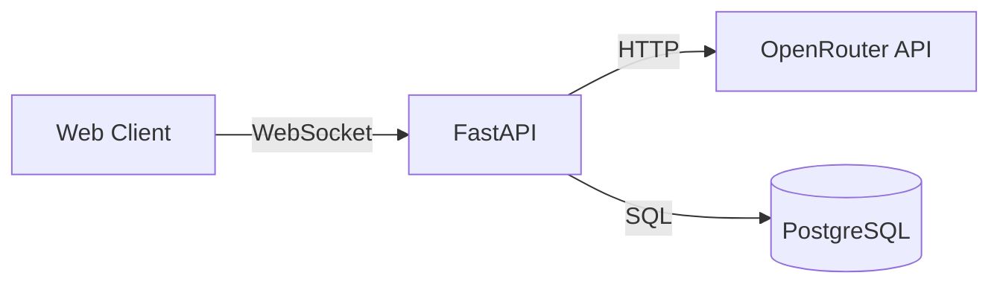

# Phase 3: Production Features - Implementation Plan

## Overview
Add production-ready features to the Resume Chatbot backend. Each task below is designed to be implemented independently.

---

## Task 1: Environment Variable Validation at Startup

### Goal
Validate critical configuration at startup to fail fast with clear error messages.

### Files to Modify
- `backend/app/core/config.py` - Add validators
- `backend/app/main.py` - Call validation in lifespan

### New Test File
- `backend/tests/test_config_validation.py`

### Implementation
1. Add `@field_validator` decorators to `Settings` class:
   - `openrouter_api_key` - reject empty or placeholder values
   - `database_url` - validate starts with `postgresql+asyncpg://` or `sqlite+aiosqlite://`
   - `resume_path` - validate file exists

2. Create `validate_settings()` function that checks all required fields

3. Call `validate_settings()` in lifespan startup before DB init

### Code Sketch
```python
# config.py
from pydantic import field_validator

@field_validator('openrouter_api_key')
@classmethod
def validate_api_key(cls, v: str) -> str:
    if not v or v == 'your_openrouter_api_key_here':
        raise ValueError('OPENROUTER_API_KEY must be configured')
    return v
```

---

## Task 2: Structured Logging with Request IDs

### Goal
Add request/session IDs to all log entries for request tracing.

### Files to Modify
- `backend/app/core/logger.py` - Add context-aware formatter

### New Files
- `backend/app/core/context.py` - Request context using contextvars

### Implementation
1. Create `context.py` with contextvars:
   - `request_id_var` - unique ID per request
   - `session_id_var` - WebSocket session ID
   - Helper functions: `get_request_id()`, `set_request_id()`, etc.

2. Create `ContextFormatter` class in `logger.py`:
   - Include `request_id` and `session_id` in log format
   - Format: `"%(asctime)s - %(name)s - %(levelname)s - [%(request_id)s] %(message)s"`

3. Set context vars at WebSocket connection start in `main.py`

### Code Sketch
```python
# context.py
import contextvars
request_id_var: contextvars.ContextVar[str] = contextvars.ContextVar('request_id', default='-')
session_id_var: contextvars.ContextVar[str] = contextvars.ContextVar('session_id', default='-')
```

---

## Task 3: Input Validation and Sanitization

### Goal
Prevent prompt injection and validate input size limits.

### Files to Modify
- `backend/app/models/websocket.py` - Add max_length, sanitization validator

### New Files
- `backend/app/core/sanitization.py` - Sanitization utilities

### New Test File
- `backend/tests/test_sanitization.py`

### Implementation
1. Create `sanitization.py` with:
   - `MAX_QUESTION_LENGTH = 2000`
   - `sanitize_input(text)` - strip control chars, normalize whitespace
   - `check_suspicious_content(text)` - detect prompt injection patterns

2. Update `QuestionMessage` in `websocket.py`:
   - Add `max_length=2000` to question field
   - Add `@field_validator` to call `sanitize_input()`

### Code Sketch
```python
# sanitization.py
import re
MAX_QUESTION_LENGTH = 2000

def sanitize_input(text: str) -> str:
    text = text[:MAX_QUESTION_LENGTH]
    text = re.sub(r'[\x00-\x08\x0b\x0c\x0e-\x1f\x7f]', '', text)
    return ' '.join(text.split()).strip()
```

---

## Task 4: Rate Limiting (20 req/min)

### Goal
Prevent API abuse with per-session rate limiting on WebSocket messages.

### Files to Modify
- `backend/app/core/config.py` - Add rate limit setting
- `backend/app/main.py` - Integrate rate limiter

### New Files
- `backend/app/core/rate_limit.py` - WebSocket rate limiter

### New Test File
- `backend/tests/test_rate_limit.py`

### Implementation
1. Add to `Settings` in `config.py`:
   ```python
   rate_limit_requests_per_minute: int = 20
   ```

2. Create `WebSocketRateLimiter` class in `rate_limit.py`:
   - In-memory tracking with sliding window
   - `is_allowed(session_id)` → bool
   - `get_remaining(session_id)` → int
   - Thread-safe with asyncio Lock

3. Integrate in WebSocket handler before LLM call:
   - Check rate limit
   - Return `RATE_LIMIT_EXCEEDED` error if exceeded

### Code Sketch
```python
# rate_limit.py
class WebSocketRateLimiter:
    def __init__(self, requests_per_minute: int = 20):
        self.limit = requests_per_minute
        self.requests: dict[str, list[datetime]] = defaultdict(list)

    async def is_allowed(self, identifier: str) -> bool:
        # Sliding window check
```

---

## Task 5: Token Counting Service

### Goal
Track token usage to prevent context window overflow.

### Dependencies to Add
```toml
# pyproject.toml
"tiktoken>=0.8.0"
```

### Files to Modify
- `backend/pyproject.toml` - Add tiktoken
- `backend/app/core/config.py` - Add token limit settings
- `backend/app/services/conversation_db.py` - Populate tokens field on save

### New Files
- `backend/app/services/token_counter.py` - Token counting service

### New Test File
- `backend/tests/test_token_counter.py`

### Implementation
1. Add to `Settings`:
   ```python
   max_context_tokens: int = 8000
   max_response_tokens: int = 2000
   ```

2. Create `TokenCounter` class:
   - Initialize with `tiktoken.get_encoding("cl100k_base")`
   - `count_tokens(text)` → int
   - `count_messages(messages)` → int (includes ~4 token overhead per message)
   - `estimate_remaining(current, max)` → int

3. Update `add_message()` to store token count in `Message.tokens` field

### Code Sketch
```python
# token_counter.py
import tiktoken

class TokenCounter:
    def __init__(self):
        self.encoding = tiktoken.get_encoding("cl100k_base")

    def count_tokens(self, text: str) -> int:
        return len(self.encoding.encode(text))
```

---

## Task 6: Conversation Pruning

### Goal
Automatically remove old messages when approaching token limits.

### Prerequisites
- Task 5 (Token Counting Service)

### Files to Modify
- `backend/app/services/prompts.py` - Add pruning logic
- `backend/app/main.py` - Call pruning before LLM call

### New Test File
- `backend/tests/test_pruning.py`

### Implementation
1. Create `prune_conversation_history()` in `prompts.py`:
   - Input: history, token_counter, system_prompt_tokens, max_tokens
   - Remove oldest messages when exceeding limit
   - Keep minimum 2 Q&A exchanges
   - Return (pruned_history, tokens_removed)
   - Log pruning events

2. Integrate in WebSocket handler:
   - Calculate system prompt tokens
   - Prune history before building full prompt

### Code Sketch
```python
# prompts.py
def prune_conversation_history(
    history: list[dict],
    token_counter: TokenCounter,
    system_tokens: int,
    max_tokens: int = 8000,
    min_exchanges: int = 2,
) -> tuple[list[dict], int]:
    available = max_tokens - system_tokens - 2500  # reserve for response
    while len(history) > min_exchanges * 2 and count > available:
        history.pop(0)
    return history, tokens_removed
```

---

## Task 7: Enhanced Health Check

### Goal
Health endpoint that verifies database connectivity and critical components.

### Files to Modify
- `backend/app/main.py` - Enhance `/health` endpoint

### Implementation
1. Add `deep: bool = False` query parameter to `/health`

2. When `deep=True`:
   - Check database: `SELECT 1` query
   - Check resume: verify loaded
   - Return component status

3. Return appropriate HTTP status:
   - 200 if all healthy
   - 503 if any component unhealthy

### Code Sketch
```python
@app.get("/health")
async def health_check(deep: bool = False):
    status = {"status": "healthy", "checks": {}}
    if deep:
        # Database check
        try:
            async with db_manager.get_session() as session:
                await session.execute(text("SELECT 1"))
            status["checks"]["database"] = "healthy"
        except Exception:
            status["checks"]["database"] = "unhealthy"
            status["status"] = "degraded"
    return JSONResponse(status, status_code=200 if status["status"] == "healthy" else 503)
```

---

## Task 8: Enhanced Error Handling

### Goal
User-friendly error messages that don't expose internal details.

### Files to Modify
- `backend/app/main.py` - Use friendly messages in `send_error_response()`

### New Files
- `backend/app/core/errors.py` - Error codes and message mapping

### New Test File
- `backend/tests/test_errors.py`

### Implementation
1. Create `ErrorCode` enum with all error types

2. Create `USER_FRIENDLY_MESSAGES` dict mapping codes to messages

3. Create `get_user_message(code)` function

4. Update `send_error_response()` to use friendly messages

### Code Sketch
```python
# errors.py
from enum import Enum

class ErrorCode(str, Enum):
    VALIDATION_ERROR = "VALIDATION_ERROR"
    RATE_LIMIT = "RATE_LIMIT"
    API_ERROR = "API_ERROR"
    # ...

USER_FRIENDLY_MESSAGES = {
    ErrorCode.RATE_LIMIT: "You're sending messages too quickly. Please wait a moment.",
    ErrorCode.API_ERROR: "The AI service is temporarily unavailable. Please try again.",
}
```

---

## Task 9: Comprehensive README

### Goal
Full documentation with architecture diagram and setup instructions.

### Files to Modify
- `backend/README.md` - Complete rewrite

### Sections to Include
1. Project Overview
2. Architecture Diagram (Mermaid)
3. Technology Stack
4. Prerequisites
5. Local Setup (Docker, env vars)
6. Database Setup and Migrations
7. Running the Server
8. API Documentation
9. WebSocket Message Formats
10. Configuration Reference
11. Testing
12. Troubleshooting

### Architecture Diagram


---

## Task 10: API Documentation Examples

### Goal
WebSocket client examples for developers.

### New Files
- `backend/docs/websocket_examples.md` - Client examples (JS, Python)
- `backend/docs/api_reference.md` - Message formats, error codes

### Content
1. JavaScript WebSocket client example
2. Python websockets client example
3. Message format reference
4. Error handling examples
5. Session resumption example

---

## Task 11: OpenAPI/Swagger Polish

### Goal
Enhanced auto-generated API documentation.

### Files to Modify
- `backend/app/main.py` - FastAPI metadata
- `backend/app/models/websocket.py` - Model examples

### Implementation
1. Update `FastAPI()` constructor with:
   - Detailed description
   - Contact info
   - License info

2. Add `model_config` with `json_schema_extra` examples to Pydantic models

### Code Sketch
```python
# main.py
app = FastAPI(
    title="Resume Chatbot API",
    description="A chatbot API that answers questions...",
    version="0.2.0",
    contact={"name": "API Support"},
)

# websocket.py
class QuestionMessage(BaseModel):
    model_config = {"json_schema_extra": {"examples": [{"type": "question", "question": "..."}]}}
```

---

## Summary: Files Changed/Created

### Modified Files
| File | Tasks |
|------|-------|
| `backend/app/core/config.py` | 1, 4, 5 |
| `backend/app/core/logger.py` | 2 |
| `backend/app/main.py` | 1, 2, 4, 6, 7, 11 |
| `backend/app/models/websocket.py` | 3, 11 |
| `backend/app/services/prompts.py` | 6 |
| `backend/app/services/conversation_db.py` | 5 |
| `backend/pyproject.toml` | 5 |
| `backend/README.md` | 9 |

### New Files
| File | Task |
|------|------|
| `backend/app/core/context.py` | 2 |
| `backend/app/core/sanitization.py` | 3 |
| `backend/app/core/rate_limit.py` | 4 |
| `backend/app/core/errors.py` | 8 |
| `backend/app/services/token_counter.py` | 5 |
| `backend/docs/websocket_examples.md` | 10 |
| `backend/docs/api_reference.md` | 10 |
| `backend/tests/test_config_validation.py` | 1 |
| `backend/tests/test_sanitization.py` | 3 |
| `backend/tests/test_rate_limit.py` | 4 |
| `backend/tests/test_token_counter.py` | 5 |
| `backend/tests/test_pruning.py` | 6 |
| `backend/tests/test_errors.py` | 8 |

---

## Recommended Implementation Order

**Independent (can start anytime):**
- Task 1: Config Validation
- Task 2: Structured Logging
- Task 3: Input Sanitization
- Task 7: Enhanced Health Check
- Task 8: Error Handling
- Task 9-11: Documentation

**Sequential dependencies:**
- Task 5 (Token Counter) → Task 6 (Pruning)
- Task 4 (Rate Limiting) depends on nothing, integrates into main.py
