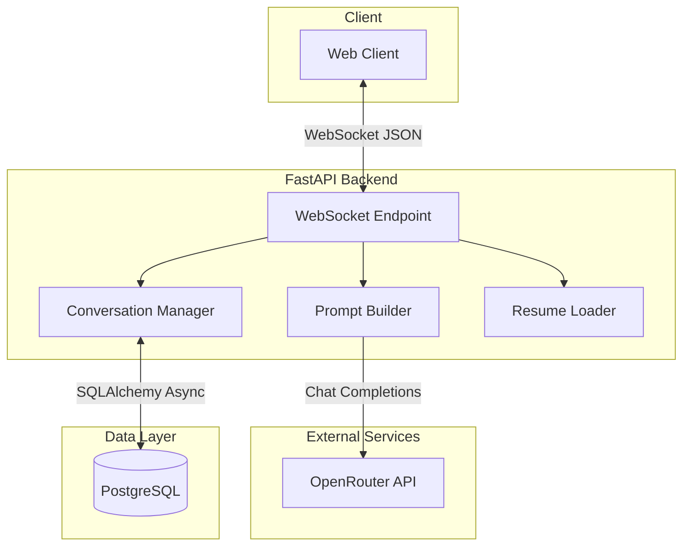
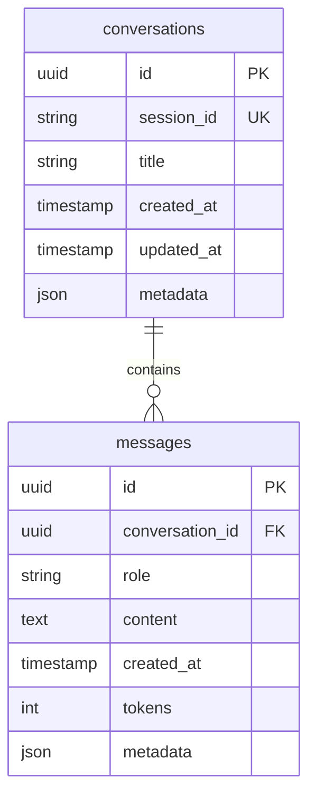

# Resume Chatbot Backend

A real-time conversational AI backend built with FastAPI that answers questions about resumes using LLM integration. Features async WebSocket communication, PostgreSQL persistence, and clean architecture patterns.

## Architecture



### Request Flow

1. Client connects via WebSocket at `/ws`
2. Resume context is loaded from memory (pre-loaded at startup)
3. User sends question as JSON message
4. System builds prompt with resume + conversation history
5. LLM generates response via OpenRouter API
6. Response is sent back via WebSocket
7. Conversation is persisted to PostgreSQL

## Technology Stack

| Component | Technology | Purpose |
|-----------|------------|---------|
| Framework | FastAPI 0.122+ | Async web framework with WebSocket support |
| Runtime | Python 3.13+ | Modern Python with native async |
| Database | PostgreSQL 16 | Conversation persistence |
| ORM | SQLAlchemy 2.0 (async) | Database operations with asyncpg driver |
| Migrations | Alembic | Schema version control |
| HTTP Client | httpx | Async API calls to LLM provider |
| LLM Gateway | OpenRouter | Multi-model LLM access (Claude, GPT-4, Llama) |
| Config | Pydantic Settings | Type-safe environment configuration |
| Package Manager | uv | Fast Python package management |
| Containerization | Docker Compose | Local development database |

## Project Structure

```
backend/
├── app/
│   ├── main.py                 # FastAPI app, WebSocket endpoint, lifespan
│   ├── core/
│   │   ├── config.py           # Pydantic Settings with validation
│   │   └── logger.py           # Structured logging setup
│   ├── db/
│   │   ├── models.py           # SQLAlchemy ORM models
│   │   ├── session.py          # Database session management
│   │   └── repositories/       # Data access layer
│   ├── models/
│   │   ├── conversation.py     # Domain models
│   │   └── websocket.py        # WebSocket message schemas
│   └── services/
│       ├── llm_client.py       # OpenRouter API client with retry logic
│       ├── conversation_db.py  # Conversation state management
│       ├── prompts.py          # Prompt templates and builders
│       └── resume_loader.py    # Resume parsing and formatting
├── tests/                      # Pytest test suite (135 tests)
├── alembic/                    # Database migrations
├── data/                       # Resume data files
└── pyproject.toml              # Dependencies and tooling config
```

## Quick Start

### Prerequisites

- Python 3.13+
- [uv](https://github.com/astral-sh/uv) package manager
- Docker (for PostgreSQL)
- OpenRouter API key ([get one free](https://openrouter.ai/))

### Setup

```bash
# Install dependencies
cd backend && uv sync

# Start PostgreSQL
docker-compose up -d

# Configure environment
cp backend/.env.example backend/.env
# Edit backend/.env and add your OPENROUTER_API_KEY

# Run database migrations
cd backend && uv run alembic upgrade head

# Start development server
cd backend && uv run uvicorn app.main:app --reload
```

The server starts at `http://localhost:8000` with a built-in chat UI.

## Configuration

All settings are managed via environment variables with Pydantic validation:

| Variable | Default | Description |
|----------|---------|-------------|
| `OPENROUTER_API_KEY` | *required* | API key for LLM access |
| `LLM_MODEL` | `meta-llama/llama-3.2-3b-instruct:free` | Model identifier |
| `LLM_TIMEOUT` | `60.0` | API request timeout (seconds) |
| `DATABASE_URL` | `postgresql+asyncpg://...` | Async database connection string |
| `DATABASE_POOL_SIZE` | `5` | Connection pool size |
| `RESUME_PATH` | `data/resume.json` | Path to resume JSON file |
| `LOG_LEVEL` | `INFO` | Logging verbosity |

### Supported LLM Models

OpenRouter provides access to multiple LLM providers:

**Free Tier (development):**
- `meta-llama/llama-3.2-3b-instruct:free`
- `google/gemini-flash-1.5-8b:free`

**Production:**
- `anthropic/claude-3.5-sonnet`
- `openai/gpt-4o`

## API Reference

### Endpoints

| Method | Path | Description |
|--------|------|-------------|
| `GET` | `/` | Interactive chat interface |
| `GET` | `/health` | Health check |
| `WS` | `/ws` | WebSocket chat endpoint |
| `GET` | `/docs` | Swagger UI documentation |
| `GET` | `/redoc` | ReDoc documentation |

### WebSocket Protocol

**Connect:** `ws://localhost:8000/ws` or `ws://localhost:8000/ws?session_id=<uuid>`

**Send Question:**
```json
{
  "type": "question",
  "question": "What programming languages does this person know?"
}
```

**Receive Response:**
```json
{
  "type": "response",
  "response": "Based on the resume, they are proficient in Python, JavaScript..."
}
```

**Error Response:**
```json
{
  "type": "error",
  "error": "Rate limit exceeded",
  "code": "RATE_LIMIT"
}
```

### Session Resumption

Pass `session_id` query parameter to resume a previous conversation:
```javascript
const ws = new WebSocket("ws://localhost:8000/ws?session_id=abc-123-def");
```

## Database Schema



### Migrations

```bash
# Run pending migrations
cd backend && uv run alembic upgrade head

# Create new migration
cd backend && uv run alembic revision --autogenerate -m "description"

# View migration history
cd backend && uv run alembic history
```

## Testing

The project includes 135 tests covering all major components:

```bash
# Run all tests
cd backend && uv run pytest

# Run with verbose output
cd backend && uv run pytest -v

# Run specific test file
cd backend && uv run pytest tests/test_websocket.py -v

# Run with coverage
cd backend && uv run pytest --cov=app --cov-report=term-missing
```

### Test Categories

- **Unit Tests:** Config validation, prompt building, resume parsing
- **Integration Tests:** Database operations, LLM client mocking
- **WebSocket Tests:** Connection handling, message flow, error cases

## Error Handling

The system implements comprehensive error handling with user-friendly messages:

| Code | Description | User Message |
|------|-------------|--------------|
| `VALIDATION_ERROR` | Invalid message format | Details about the validation failure |
| `RATE_LIMIT` | OpenRouter rate limit hit | "Please try again later" |
| `API_ERROR` | LLM API error | "API error: [details]" |
| `DATABASE_ERROR` | PostgreSQL connection issue | "Database error. Please try again." |
| `INTERNAL_ERROR` | Unexpected server error | "An unexpected error occurred" |

### Retry Logic

The LLM client implements exponential backoff:
- Max retries: 3
- Backoff: 1s, 2s, 4s
- Handles: Timeouts, rate limits, network errors

## Development

### Code Quality

```bash
# Run linter
cd backend && uv run ruff check .

# Auto-fix issues
cd backend && uv run ruff check --fix .

# Format code
cd backend && uv run ruff format .
```

### Adding Dependencies

```bash
cd backend

# Add production dependency
uv add <package>

# Add dev dependency
uv add --dev <package>
```

## Key Design Decisions

1. **Direct LLM Calls**: Uses httpx for direct API calls instead of LangChain, keeping the stack simple and transparent.

2. **Full Context Injection**: Sends complete resume on every request rather than using RAG/embeddings, ensuring consistent context.

3. **WebSocket-First**: Real-time bidirectional communication for responsive chat experience.

4. **Async Throughout**: All I/O operations are async (database, HTTP, WebSocket) for optimal concurrency.

5. **Session Persistence**: Conversations stored in PostgreSQL with session resumption support.

## License

MIT
