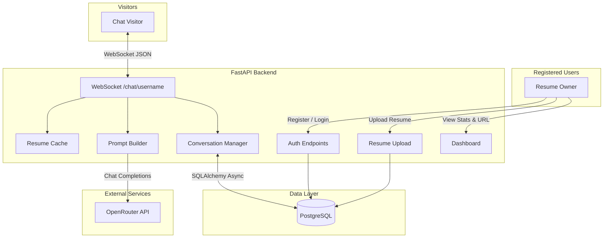
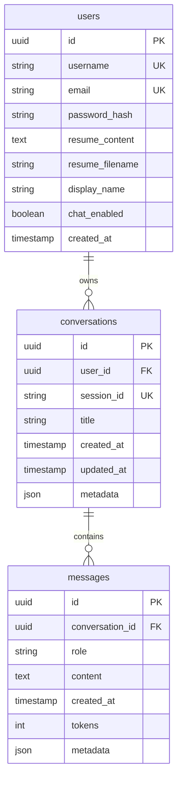

# Resume Chatbot Backend

A multi-tenant conversational AI backend built with FastAPI. Users register, upload their resume, and get a shareable public chatbot at `/chat/{username}` that answers questions about their resume using LLM integration. Features JWT authentication, async WebSocket communication, PostgreSQL persistence, and clean architecture patterns.

**[Try the Live Demo →](https://resume-chatbot-vfczoegceq-ey.a.run.app)**

## About This Project

### Purpose

This project demonstrates a production-ready approach to building multi-tenant conversational AI applications. Each registered user uploads their own resume and receives a shareable chatbot URL. Rather than using complex RAG (Retrieval Augmented Generation) pipelines with vector databases, it injects the full resume context directly into each LLM request alongside conversation history.

### Key Features

- **Multi-User Support**: Anyone can register, upload their resume, and get their own chatbot
- **Shareable Public Chatbot**: Each user gets a public URL at `/chat/{username}` — no login required for visitors
- **JWT Authentication**: Secure user registration, login, and profile management
- **Resume Upload**: Accepts PDF, DOCX, TXT, Markdown, and JSON files (up to 5 MB)
- **Real-time WebSocket Chat**: Bidirectional communication for responsive conversational experience
- **Session Persistence**: Conversations stored in PostgreSQL with per-user isolation and session resumption
- **Direct Context Injection**: Full resume sent with each request—no embeddings or vector search needed
- **Dashboard & Analytics**: Conversation/message stats and public chatbot URL management
- **Multi-Model Support**: Access to Claude, GPT-4, Llama, and more via OpenRouter gateway
- **Production-Ready**: Rate limiting, connection pooling, retry logic, and comprehensive error handling
- **Async Throughout**: Non-blocking I/O for database, HTTP, and WebSocket operations

### Tech Stack at a Glance

| Layer | Technology |
|-------|------------|
| API | FastAPI + WebSockets |
| Auth | JWT (HS256) + pwdlib (bcrypt) |
| LLM | OpenRouter (multi-model gateway) |
| Database | PostgreSQL + SQLAlchemy async |
| File Parsing | PyPDF + python-docx |
| Runtime | Python 3.13 + uv |

## Architecture


```mermaid
graph TB
    subgraph Visitors
        VC[Chat Visitor]
    end

    subgraph "Registered Users"
        RU[Resume Owner]
    end

    subgraph "FastAPI Backend"
        AUTH[Auth Endpoints]
        RES[Resume Upload]
        DASH[Dashboard]
        WS[WebSocket /chat/username]
        PM[Prompt Builder]
        CM[Conversation Manager]
        RC[Resume Cache]
    end

    subgraph "External Services"
        OR[OpenRouter API]
    end

    subgraph "Data Layer"
        PG[(PostgreSQL)]
    end

    RU -->|Register / Login| AUTH
    RU -->|Upload Resume| RES
    RU -->|View Stats & URL| DASH
    VC <-->|WebSocket JSON| WS
    WS --> RC
    WS --> PM
    WS --> CM
    PM -->|Chat Completions| OR
    CM <-->|SQLAlchemy Async| PG
    RES --> PG
    AUTH --> PG
```

### User Flow

1. **Register** — `POST /auth/register` with username, email, password
2. **Upload Resume** — `POST /resume/upload` with Bearer token (PDF, DOCX, TXT, MD, JSON)
3. **Get your URL** — `GET /dashboard` returns your public chatbot URL
4. **Share** — Anyone visits `/chat/{username}` and chats with your resume

### WebSocket Request Flow

1. Visitor connects to `/chat/{username}`
2. Server looks up user, validates resume uploaded and chat enabled
3. Resume context loaded from per-user cache (built once, reused)
4. User sends question as JSON message
5. System builds prompt: system message + resume + conversation history + question
6. LLM generates response via OpenRouter API
7. Response sent back via WebSocket
8. Conversation persisted to PostgreSQL, scoped to resume owner's user ID

## Technology Stack

| Component | Technology | Purpose |
|-----------|------------|---------|
| Framework | FastAPI 0.122+ | Async web framework with WebSocket support |
| Runtime | Python 3.13+ | Modern Python with native async |
| Auth | pwdlib + python-jose | Password hashing (bcrypt) and JWT tokens |
| Database | PostgreSQL 16 | User accounts and conversation persistence |
| ORM | SQLAlchemy 2.0 (async) | Database operations with asyncpg driver |
| Migrations | Alembic | Schema version control |
| HTTP Client | httpx | Async API calls to LLM provider |
| LLM Gateway | OpenRouter | Multi-model LLM access (Claude, GPT-4, Llama) |
| File Parsing | PyPDF + python-docx | Resume text extraction from PDF/DOCX |
| Config | Pydantic Settings | Type-safe environment configuration |
| Package Manager | uv | Fast Python package management |
| Containerization | Docker Compose | Local development database |

## Project Structure

```
backend/
├── app/
│   ├── main.py                 # FastAPI app, WebSocket endpoint, lifespan
│   ├── api/
│   │   ├── auth.py             # /auth/* endpoints (register, login, profile)
│   │   ├── resumes.py          # /resume/* endpoints (upload, delete, toggle)
│   │   └── dashboard.py        # /dashboard/* endpoints (stats, public URL)
│   ├── core/
│   │   ├── auth.py             # JWT creation/validation, password hashing
│   │   ├── config.py           # Pydantic Settings with validation
│   │   ├── context.py          # Session context management (contextvars)
│   │   ├── dependencies.py     # FastAPI auth dependency (get_current_user)
│   │   ├── errors.py           # Error codes and user-friendly messages
│   │   ├── logger.py           # Structured logging setup
│   │   ├── rate_limit.py       # WebSocket rate limiting (sliding window)
│   │   └── sanitization.py     # Input sanitization and prompt injection prevention
│   ├── db/
│   │   ├── models.py           # SQLAlchemy ORM models (User, Conversation, Message)
│   │   ├── session.py          # Database session management
│   │   └── repositories/       # Data access layer
│   ├── models/
│   │   ├── conversation.py     # Domain models
│   │   └── websocket.py        # WebSocket message schemas
│   └── services/
│       ├── llm_client.py       # OpenRouter API client with retry logic
│       ├── conversation_db.py  # Conversation state management
│       ├── prompts.py          # Prompt templates and builders
│       ├── resume_loader.py    # Resume context caching (per-user LRU)
│       ├── text_extractor.py   # PDF/DOCX/TXT/MD/JSON text extraction
│       └── token_counter.py    # Token counting with tiktoken
├── tests/                      # Pytest test suite
├── alembic/                    # Database migrations
├── data/                       # Resume data files (legacy)
└── pyproject.toml              # Dependencies and tooling config
```

## Quick Start

### Prerequisites

- Python 3.13+
- [uv](https://github.com/astral-sh/uv) package manager
- Docker (for PostgreSQL)
- OpenRouter API key ([get one free](https://openrouter.ai/))

### Setup

```bash
# Start PostgreSQL (from project root)
docker-compose up -d

# Navigate to backend
cd backend

# Install dependencies
uv sync

# Configure environment
cp .env.example .env
# Edit .env and add your OPENROUTER_API_KEY and JWT_SECRET_KEY

# Run database migrations
uv run alembic upgrade head

# Start development server
uv run uvicorn app.main:app --reload
```

The server starts at `http://localhost:8000`. Visit `/` for the landing page or register via `POST /auth/register`.

## Configuration

All settings are managed via environment variables with Pydantic validation:

| Variable | Default | Description |
|----------|---------|-------------|
| `OPENROUTER_API_KEY` | *required* | API key for LLM access |
| `JWT_SECRET_KEY` | *required* | Secret key for signing JWT tokens |
| `JWT_ALGORITHM` | `HS256` | JWT signing algorithm |
| `JWT_ACCESS_TOKEN_EXPIRE_MINUTES` | `1440` | Token TTL in minutes (24 hours) |
| `MAX_RESUME_FILE_SIZE` | `5242880` | Max resume upload size in bytes (5 MB) |
| `LLM_MODEL` | `google/gemini-2.5-flash` | Model identifier |
| `LLM_TIMEOUT` | `60.0` | API request timeout (seconds) |
| `DATABASE_URL` | `postgresql+asyncpg://...` | Async database connection string |
| `DATABASE_POOL_SIZE` | `2` | Connection pool size |
| `LOG_LEVEL` | `INFO` | Logging verbosity |

### Supported LLM Models

OpenRouter provides access to multiple LLM providers:

**Recommended (cheap and reliable):**
- `google/gemini-2.5-flash` - $0.30/M input, $2.50/M output

**Other options:**
- `google/gemini-2.0-flash-001` - Fast and affordable
- `anthropic/claude-3.5-sonnet` - High quality
- `openai/gpt-4o` - OpenAI flagship

## API Reference

### Endpoints

| Method | Path | Auth | Description |
|--------|------|------|-------------|
| `GET` | `/` | — | Landing page |
| `GET` | `/health` | — | Health check |
| `GET` | `/docs` | — | Swagger UI documentation |
| `POST` | `/auth/register` | — | Register a new user account |
| `POST` | `/auth/login` | — | Login and receive JWT token |
| `GET` | `/auth/me` | Bearer | Get current user profile |
| `PATCH` | `/auth/profile` | Bearer | Update display name |
| `POST` | `/resume/upload` | Bearer | Upload resume file (PDF/DOCX/TXT/MD/JSON) |
| `GET` | `/resume` | Bearer | Get resume status |
| `DELETE` | `/resume` | Bearer | Delete uploaded resume |
| `PATCH` | `/resume/chat-enabled` | Bearer | Toggle chatbot on/off |
| `GET` | `/dashboard` | Bearer | Dashboard with public chatbot URL |
| `GET` | `/dashboard/analytics` | Bearer | Conversation and message stats |
| `GET` | `/chat/{username}` | — | Public chat UI for a user's resume |
| `WS` | `/chat/{username}` | — | Public WebSocket chat endpoint |
| `WS` | `/ws` | — | Legacy WebSocket endpoint (deprecated) |

### WebSocket Protocol

**Connect:** `ws://localhost:8000/chat/{username}`

**Send Question:**
```json
{
  "type": "question",
  "question": "What programming languages does this person know?"
}
```

**Receive Response:**
```json
{
  "type": "response",
  "response": "Based on the resume, they are proficient in Python, JavaScript..."
}
```

**Error Response:**
```json
{
  "type": "error",
  "error": "Chat is not available for this user",
  "code": "CHAT_DISABLED"
}
```

### Error Codes

| Code | Description |
|------|-------------|
| `USER_NOT_FOUND` | Username does not exist |
| `NO_RESUME` | User has not uploaded a resume |
| `CHAT_DISABLED` | User has disabled their chatbot |
| `VALIDATION_ERROR` | Invalid message format |
| `RATE_LIMIT` | Rate limit exceeded |
| `API_ERROR` | LLM API error |
| `DATABASE_ERROR` | PostgreSQL error |
| `INTERNAL_ERROR` | Unexpected server error |

### Session Resumption

Pass `session_id` query parameter to resume a previous conversation:
```javascript
const ws = new WebSocket("ws://localhost:8000/chat/username?session_id=abc-123-def");
```

## Database Schema


```mermaid
erDiagram
    users {
        uuid id PK
        string username UK
        string email UK
        string password_hash
        text resume_content
        string resume_filename
        string display_name
        boolean chat_enabled
        timestamp created_at
    }

    conversations {
        uuid id PK
        uuid user_id FK
        string session_id UK
        string title
        timestamp created_at
        timestamp updated_at
        json metadata
    }

    messages {
        uuid id PK
        uuid conversation_id FK
        string role
        text content
        timestamp created_at
        int tokens
        json metadata
    }

    users ||--o{ conversations : owns
    conversations ||--o{ messages : contains
```

### Migrations

```bash
# Run pending migrations
cd backend && uv run alembic upgrade head

# Create new migration
cd backend && uv run alembic revision --autogenerate -m "description"

# View migration history
cd backend && uv run alembic history
```

## Testing

```bash
# Run all tests
cd backend && uv run pytest

# Run with verbose output
cd backend && uv run pytest -v

# Run specific test file
cd backend && uv run pytest tests/test_auth.py -v

# Run with coverage
cd backend && uv run pytest --cov=app --cov-report=term-missing
```

### Test Categories

- **Unit Tests:** Config validation, prompt building, resume parsing, text extraction, auth utilities
- **Integration Tests:** Database operations, LLM client mocking, tenant isolation
- **WebSocket Tests:** Connection handling, message flow, per-user routing, error cases
- **API Tests:** Auth endpoints, resume upload, dashboard, analytics

## Error Handling

The system implements comprehensive error handling with user-friendly messages and exponential backoff retry logic for LLM calls (max 3 retries: 1s, 2s, 4s).

## Development

### Code Quality

```bash
# Run linter
cd backend && uv run ruff check .

# Auto-fix issues
cd backend && uv run ruff check --fix .

# Format code
cd backend && uv run ruff format .
```

### Adding Dependencies

```bash
cd backend

# Add production dependency
uv add <package>

# Add dev dependency
uv add --dev <package>
```

## Key Design Decisions

1. **Multi-Tenant by User ID**: All conversation queries accept an optional `user_id` filter, scoping data to each resume owner.

2. **Public Chatbot, Private Controls**: `/chat/{username}` is public — no auth needed to chat. Resume owners control availability via the `chat_enabled` flag.

3. **Per-User Resume Cache**: Resume contexts are built once per user and cached in an LRU cache (keyed by user ID), avoiding repeated text processing on every connection.

4. **Direct LLM Calls**: Uses httpx for direct API calls instead of LangChain, keeping the stack simple and transparent.

5. **Full Context Injection**: Sends complete resume on every request rather than using RAG/embeddings, ensuring consistent context.

6. **Async Throughout**: All I/O operations are async (database, HTTP, WebSocket) for optimal concurrency.

## Deployment

This application is deployed on Google Cloud Run with Neon PostgreSQL. See [docs/DEPLOYMENT.md](docs/DEPLOYMENT.md) for the full deployment guide including cost protection setup.

## License

MIT
